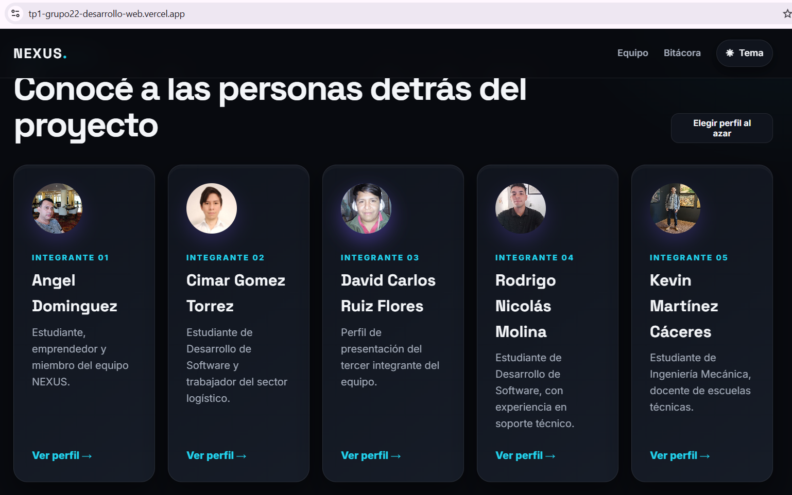
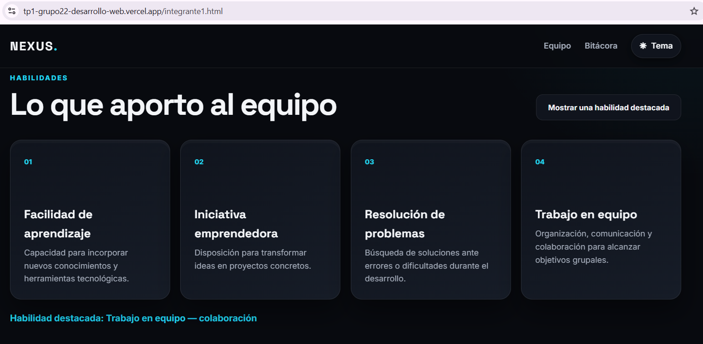
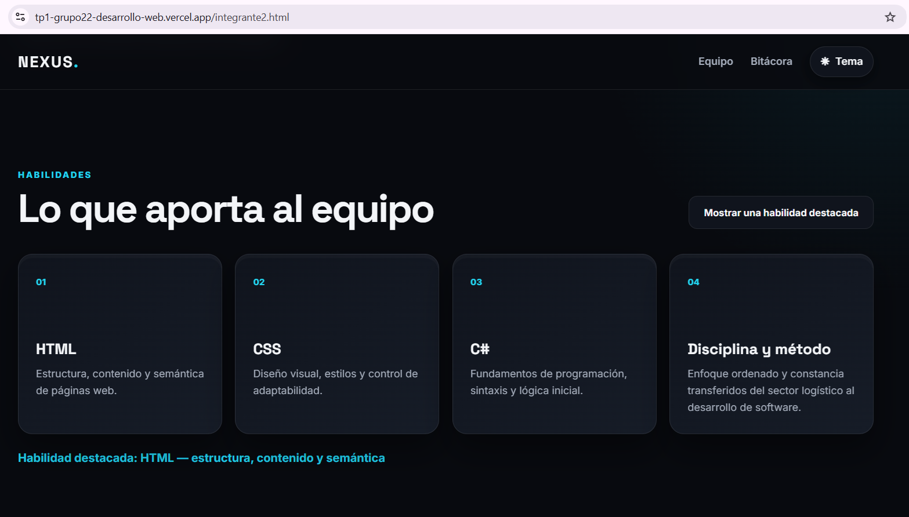
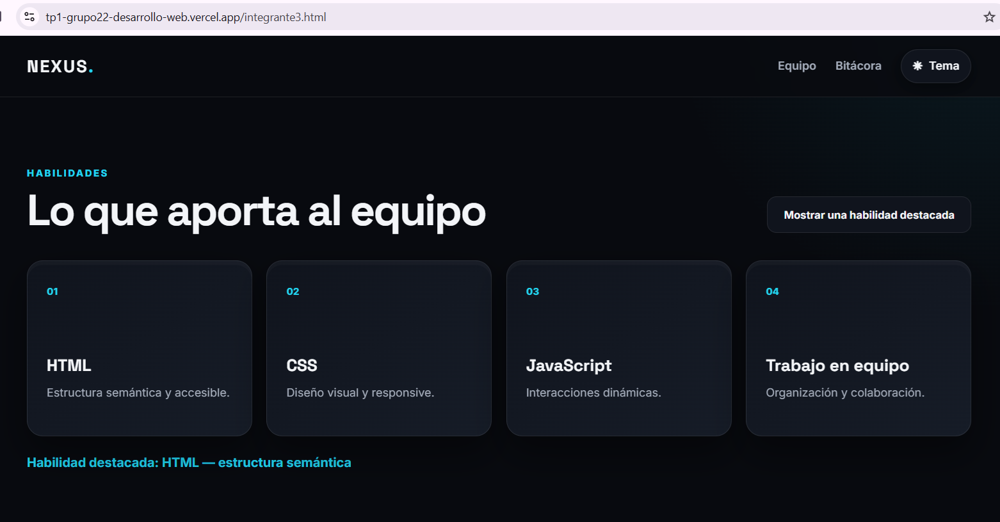
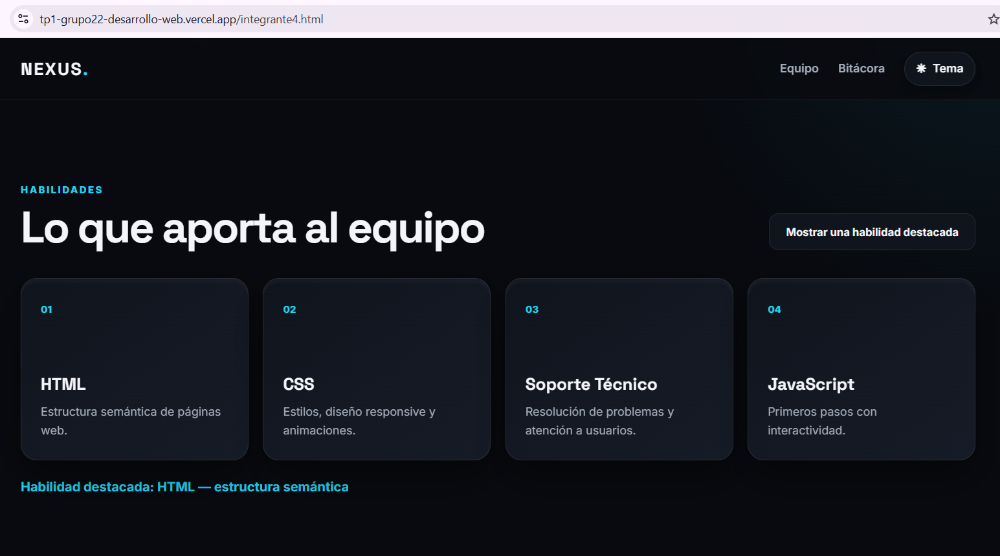
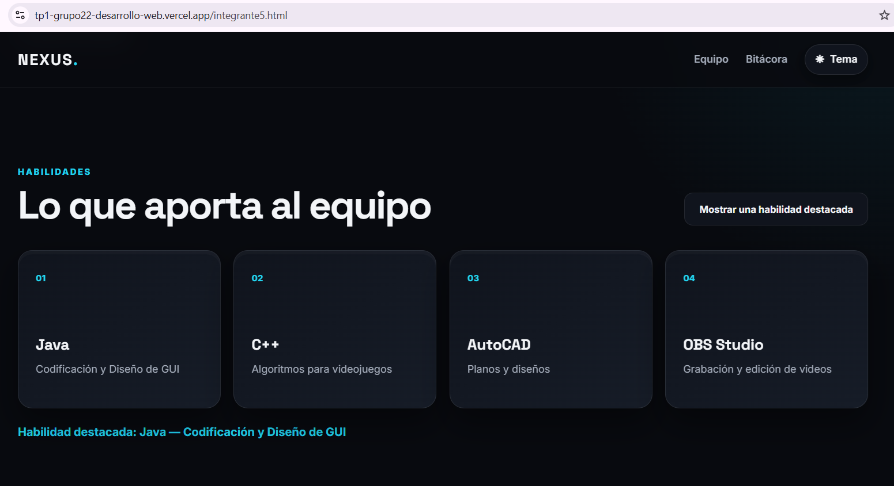

# NEXUS — Trabajo Práctico Grupal 1

## Descripción

Sitio web grupal desarrollado para **Desarrollo de Sistemas Web · Front End · 2026 · 2° B · Grupo 22**.

El proyecto presenta una portada del equipo, cinco perfiles individuales y una bitácora del proceso de desarrollo.

## Integrantes

| Integrante | GitHub | Responsabilidad principal |
|---|---|---|
|Angel Dominguez | [`ad29dominguez-design`](https://github.com/ad29dominguez-design) | Coordinación general, consigna, rúbrica, revisión final de `index.html` |
| Kevin David Martínez | [`Lunreth`](https://github.com/Lunreth) | Creación y configuración del repositorio, colaboradores, estructura base (`index.html`), CSS y JavaScript |
| Cimar Gomez Torrez | [`CimarGomez`](https://github.com/CimarGomez) | Diseño general, `css/styles.css`, Google Fonts, paleta y breakpoints |
| David Carlos Ruiz Flores | [`Davidruizf`](https://github.com/Davidruizf) | JavaScript general de la portada, pruebas de navegación y enlaces |
| Rodrigo Nicolás Molina | [`Rodrigo-Molina12506`](https://github.com/Rodrigo-Molina12506) | Bitácora, README, documentación de tecnologías, estructura, funciones JS y uso de IA |

## Tecnologías

- HTML5 semántico
- CSS3 (variables CSS, Flexbox, Grid, media queries)
- JavaScript (vanilla, sin frameworks)
- Google Fonts (`Inter`, `Space Grotesk`)
- Git y GitHub (repositorio con colaboradores, algunos vía GitHub Desktop)
- Vercel (publicación continua)

## Estructura de archivos

```text
/
├── index.html         → Portada del equipo
├── integrante1.html   → Perfil de Angel Dominguez (completo)
├── integrante2.html   → Perfil de Cimar Gomez (completo)
├── integrante3.html   → Perfil de David Ruiz (completo)
├── integrante4.html   → Perfil de Rodrigo Molina (completo)
├── integrante5.html   → Perfil de Kevin Martínez (completo)
├── bitacora.html      → Registro del proceso de desarrollo
├── css/
│   └── styles.css     → Hoja de estilos compartida por todo el sitio
├── js/
│   └── script.js      → Lógica compartida (tema, perfil al azar, interacción por perfil)
└── img/               → Fotos y avatares de cada integrante
```

## Guía de estilos

  - **Tipografías:** `Space Grotesk` (títulos) e `Inter` (texto), vía Google Fonts.
  - **Paleta (modo oscuro, por defecto):**
  - Fondo: `#080a0f` · Superficie: `#10141d` / `#161c27`
  - Texto: `#f3f5f8` · Texto secundario: `#a5adbb`
  - Acento principal: `#7c5cff` (violeta) · Acento secundario: `#22d3ee` (cian)
  - **Paleta (modo claro):**
  - Fondo: `#f1f3f7` · Superficie: `#ffffff` / `#e9edf4`
  - Texto: `#141923` · Acento principal: `#6046d9` · Acento secundario: `#0891b2`
  - El botón **Tema** alterna entre modo oscuro y modo claro, y guarda la preferencia en `localStorage` (persiste al navegar entre páginas).
  - Diseño de tarjetas con sombras y bordes suaves (`.card-3d`) para dar sensación de profundidad.
  - **Iconografía:** se utilizaron símbolos Unicode y emojis para representar acciones de la interfaz, como el cambio de tema claro/oscuro y la flecha de regreso. No se emplearon bibliotecas externas de iconos.

### Breakpoints obligatorios

- **400 px** → adaptación para celulares pequeños.
- **900 px** → adaptación para tablets y pantallas intermedias.
- **1200 px** → distribución amplia del equipo (grid de 3 columnas en la portada).

## Funciones JavaScript

### Portada (`index.html`)

**Botón “Elegir perfil al azar”** — selecciona aleatoriamente uno de los cinco perfiles mediante JavaScript y redirige al usuario hacia la página del integrante elegido.



### Perfil de Angel (`integrante1.html`)

**Botón “Mostrar una habilidad destacada”** — selecciona al azar una habilidad de Angel y la muestra dinámicamente en pantalla.



### Perfil de Cimar (`integrante2.html`)

**Botón “Mostrar una habilidad destacada”** — selecciona al azar una habilidad de Cimar y la muestra dinámicamente en pantalla.



### Perfil de David (`integrante3.html`)

**Botón “Mostrar una habilidad destacada”** — selecciona al azar una habilidad de David y la muestra dinámicamente en pantalla.



### Perfil de Rodrigo (`integrante4.html`)

**Botón “Mostrar una habilidad destacada”** — selecciona al azar una habilidad de Rodrigo y la muestra dinámicamente en pantalla.



### Perfil de Kevin (`integrante5.html`)

**Botón “Mostrar una habilidad destacada”** — selecciona al azar una habilidad de Kevin y la muestra dinámicamente en pantalla.


## Bitácora

La página `bitacora.html` registra el proceso real del proyecto: la organización inicial del equipo, la identidad visual, la construcción del sitio por parte de Kevin, el trabajo de Ángel en su perfil (incluyendo una dificultad real que se resolvió, relacionada con el nombre de un archivo de imagen), las pruebas realizadas, el control de versiones, la publicación, el trabajo de David en su propio perfil (incluyendo la actualización de la tarjeta de portada y una observación técnica sobre clases de CSS que quedarán obsoletas al completarse el último perfil), el trabajo de Cimar en el suyo, y los aportes de documentación de Rodrigo y de infraestructura de Kevin.

## Uso de Inteligencia Artificial

Se utilizó **ChatGPT 5.6 de OpenAI**, mediante un **plan pago**. El equipo ya contaba con experiencia previa en el uso de esta herramienta.

La inteligencia artificial se utilizó como apoyo para organizar y revisar contenidos, mejorar la redacción del README y la bitácora, revisar código HTML, CSS y JavaScript, detectar errores, proponer posibles soluciones y orientar el uso de GitHub Desktop. También colaboró en la verificación del cumplimiento de la consigna.

Todas las respuestas y propuestas generadas fueron revisadas, probadas y adaptadas por los integrantes antes de incorporarlas al proyecto. La herramienta no reemplazó el trabajo ni las decisiones del equipo.

Las fotografías utilizadas corresponden a imágenes personales de los integrantes y no fueron generadas ni modificadas mediante inteligencia artificial. Por ese motivo, no se utilizaron prompts para generar imágenes.

## Publicación

URL de Vercel:

[`https://tp1-grupo22-desarrollo-web.vercel.app`](https://tp1-grupo22-desarrollo-web.vercel.app/)

## Estado del proyecto (al momento de esta actualización)

- ✅ Portada, estructura de archivos y CSS compartido funcionando.
- ✅ Perfil de Angel Dominguez completo.
- ✅ Perfil de Kevin Martínez completo.
- ✅ Perfil de Rodrigo Molina completo, con interacción JS propia.
- ✅ Perfil de David Carlos Ruiz Flores completo, con foto y tarjeta de portada actualizada.
- ✅ Perfil de Cimar Gomez completo.
- ✅ Capturas de las funciones de JavaScript agregadas.
- ✅ Uso de IA de Cimar documentado.
- ✅ Entradas de bitácora de Cimar agregadas.
- ✅ Limpieza de clases CSS de los avatares realizada.

## Evolución

El proyecto quedó completo con el contenido real de los cinco integrantes: perfiles, interacciones en JavaScript, documentación y bitácora. Como próximos pasos, el equipo podría seguir ampliando la identidad visual del sitio o sumar nuevas funcionalidades en trabajos posteriores.